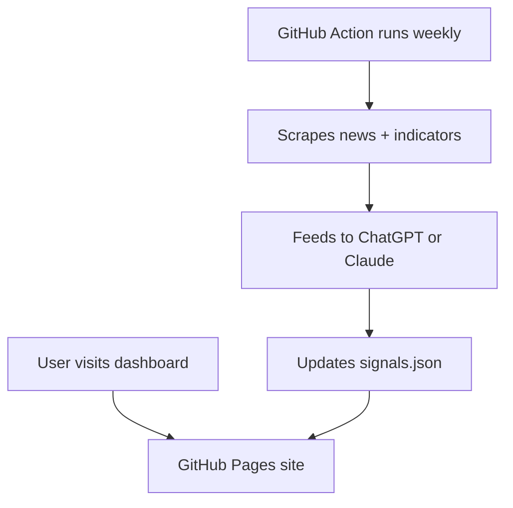

# AI 2027 Early Warning Dashboard

This project tracks five key indicators to assess whether the world is trending toward the speculative “AI 2027” disruption scenario. It presents a public-facing narrative dashboard (hosted via GitHub Pages) that updates automatically via a backend signal-monitoring pipeline. This document outlines the architecture, signal sources, and design rationale — allowing future continuation or handoff.

Source scenario: [AI 2027](https://ai-2027.com) by Daniel Kokotajlo, Scott Alexander, Thomas Larsen, Eli Lifland, and Romeo Dean (AI Futures Project, April 2025).

---

## 🌍 Concept Summary

In response to the fictional scenario _AI 2027_, ChatGPT was prompted to generate a set of "signals to watch" across the domains of policy, labor, technology, public opinion, and macroeconomics. These signals form the basis of a public dashboard that visually communicates AI’s trajectory over time — accelerating, stabilizing, or unclear.

Each signal's status is assessed automatically using GenAI models based on relevant real-world events.

---

## 🔭 Signals Monitored

1. **Policy Developments** – AI regulations, labor protections, UBI pilots, algorithmic management laws.
2. **Labor Market Shifts** – Layoffs, unemployment, job churn, upskilling efforts.
3. **Technological Benchmarks** – Breakthroughs in autonomy, performance plateaus, energy costs.
4. **Public Opinion & Culture** – Sentiment, protest, election themes, media framing.
5. **Economic Indicators** – Productivity vs. wage growth, inequality measures, labor share.

Each signal is assigned a classification:
- 📈 Accelerating
- 📉 Stabilizing
- ❓ Unclear

---

## 🖼️ Frontend (GitHub Pages UI)

The user-facing site includes:

* An introduction explaining the origin of the signals (via ChatGPT prompt + AI 2027 reading)
* A visual “doomsday clock”-style dashboard (one per signal + one global indicator)
* Historical snapshots or archives (optional)
* A `signals.json` or `signals.yaml` file embedded in the repo and updated automatically

Frontend tech options:
* Astro or Eleventy for static-site generation
* Plain HTML/CSS/JS or D3 for visualization
* Hosted on GitHub Pages

---

## ⚙️ Backend (Signal Monitoring Pipeline)

A GitHub Action (or cron job) runs on a schedule (weekly or monthly) to:

1. Collect news and data for each domain:
   * e.g., Layoffs.fyi, BLS, WEF, arXiv, Reddit, OpenAI blog
2. Pass the summaries to a GenAI model (ChatGPT or Claude)
3. Classify each signal’s trajectory (accelerating, stabilizing, unclear)
4. Save the result to `data/signals.json` for frontend consumption

---

## 🧠 GenAI Analyst

The pipeline sends the collected summaries to an LLM (OpenAI or Anthropic) and asks for a JSON classification of each signal. The model is configurable in the pipeline or the Action; the default is not decided yet.

---

### 📝 Sample GenAI Prompt

```
You are a Signal Analyst monitoring early indicators of the "AI 2027" disruption scenario.

You are given real-world news summaries across 5 domains:
- Policy
- Labor
- Technology
- Culture
- Economics

For each domain:
1. Classify the trend: 📈 Accelerating, 📉 Stabilizing, or ❓ Unclear
2. Justify in 1–2 sentences
3. Assign a confidence score (1–5)

Respond in JSON format.
```

---

## 🔁 Project Flow



---

## 📁 Repo Structure

```
ai-2027-signal-dashboard/
├── site/                  # Static site frontend (Astro/HTML/D3/etc)
├── data/
│   └── signals.json       # Auto-updated signal statuses
├── pipeline/
│   ├── fetch_sources.py   # News + data fetcher
│   ├── classify_signals.py# ChatGPT/Claude signal analyst
│   └── summarize.md       # Last GPT/Claude output
├── .github/
│   └── workflows/
│       └── update_signals.yml  # GitHub Action runner
└── README.md              # This file
```

---

## 🗒️ Notes

* The project is built for simplicity, transparency, and portability.
* GitHub Pages is used for hosting the frontend.
* GitHub Actions handles backend automation on a schedule.

---

## ✅ Next Steps (Restart Checklist)

- [ ] Build or refine the static site in `site/`
- [ ] Populate `data/signals.json` with example content (manual or generated)
- [ ] Customize and test the GenAI prompt with ChatGPT or Claude
- [ ] Finalize the GitHub Action in `.github/workflows/update_signals.yml`
- [ ] Set up API keys (OpenAI or Anthropic) via repo secrets
- [ ] Optional: Add history tracking for previous signal states
- [ ] Optional: Add "last updated" badges or weekly digest output

---

_This document reflects the project design as of June 2025._

---

AI-Attribution: AI-G ([what this means](https://langd0n.com/ai-attribution)). Langdon White directed the design; ChatGPT drafted it in June 2025. Edited 2026-09-25: added the source citation, shortened the analyst section, and removed an IDE note.
